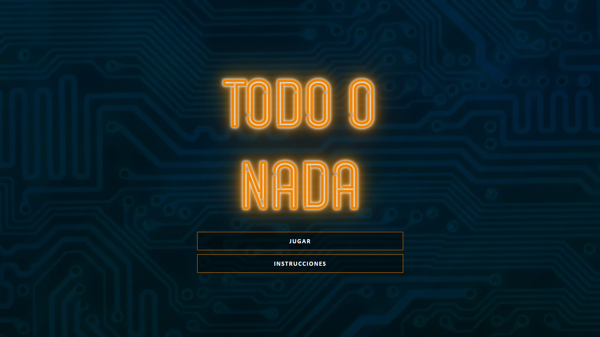
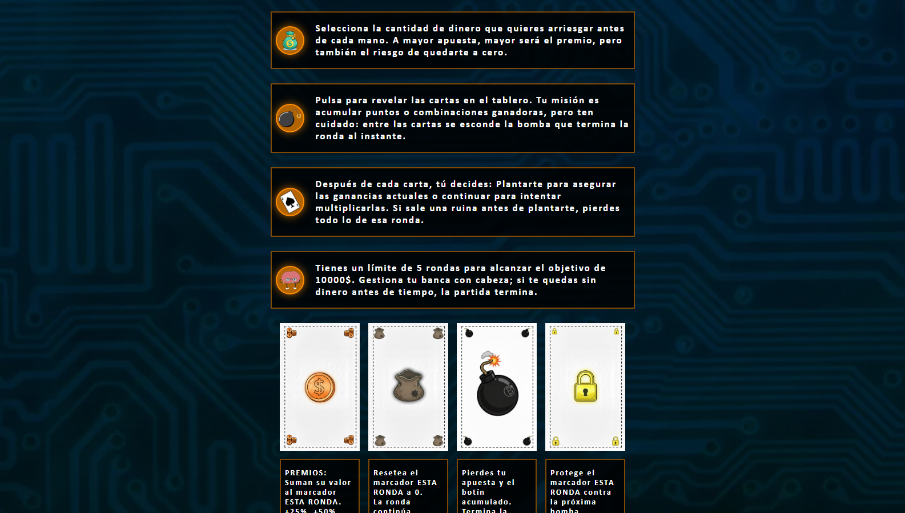
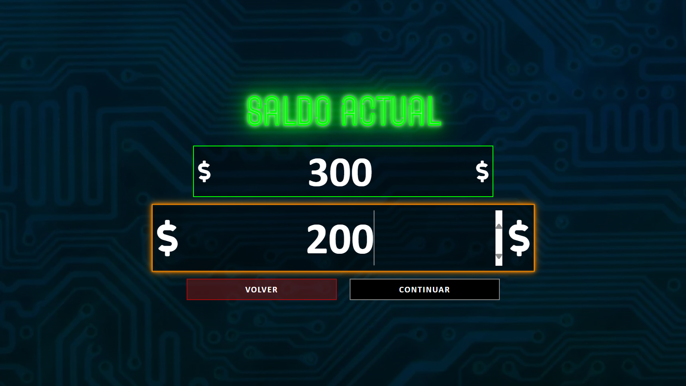
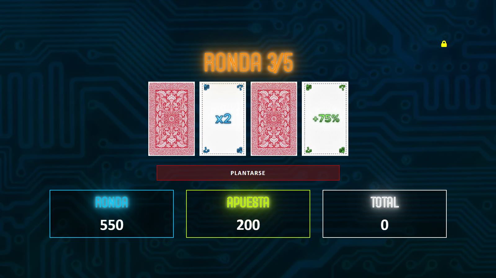
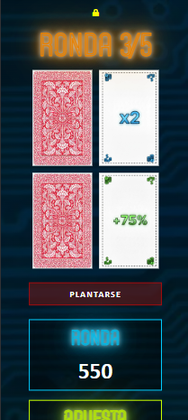

# Todo o Nada - JS Strategy Game 🃏💣

A dynamic "risk vs. reward" strategy game built with **Vanilla JavaScript**. Players must manage their starting budget, place strategic bets, and reveal cards to reach a $10,000 goal within 5 rounds.

## 🚀 Live Demo
🔗 [Play "Todo o Nada" Now](https://juanvalentin.alwaysdata.net/04/)

## 📸 Gameplay Flow

| 1. Main Menu | 2. Instructions | 3. Betting System |
| :---: | :---: | :---: |
|  |  |  |

### 🕹️ The Game in Action (Desktop & Mobile)
<div align="center">
  <p><b>Main Game Screen</b></p>
  
  <br><br>
  <p><b>Mobile Experience</b></p>
  
</div>

## 🛠️ Tech Stack
* **HTML5 & CSS3:** Custom UI with responsive layouts and interactive animations.
* **JavaScript (ES6+):** Core game engine, RNG (Random Number Generation) logic, and DOM manipulation.
* **Web Audio API:** Immersive sound effects and background music system.

## 🎨 Design Process
Every great project starts with a plan. Before writing a single line of code, I sketched the core mechanics and UI flow.

* **Conceptualization:** The initial idea was to create a high-stakes betting game where "greed" is the main enemy.
* **Wireframing:** I developed a manual sketch (available in this repo as `Juego.pdf`) to define the layout of the three main screens: Main menu, Betting, and Gameplay.
* **Evolution:** You can see how the project evolved from a simple drawing with basic stats (Balance, Bet, Rounds) to a polished digital product with custom icons, animations, and sound feedback.

## ✅ Key Features
- **Dynamic Betting:** Real-time balance management and input validation.
- **Weighted RNG:** Each card has different probabilities (Prizes, Bombs, Shields, and Game-ending Ruin).
- **Interactive UX:** Custom notification system and state-based UI transitions.
- **Responsive Design:** Fully optimized for desktop, tablet, and mobile browsers.

## 📂 Project Structure
```bash
.
├── ficheros/           # Logic and Styles
│   ├── webfonts/       # Custom typography
│   ├── all.css         # FontAwesome icons
│   ├── apuesta.css     # Betting screen styles
│   ├── instrucciones.css # Help screen styles
│   ├── juego.css       # Core gameplay styles
│   ├── menu.css        # Main menu styles
│   └── script.js       # Main Game Engine
├── imagenes/           # Visual Assets
│   ├── *.jpg/*.png     # Game cards and UI icons
│   └── *.mp3/*.wav     # Sound effects and music
├── index.html          # Main Entry Point
├── Juego.pdf           # Initial design sketches
└── README.md           # Project documentation
```
## 🧠 Learning Outcomes
- Managing **notifications** using setTimeout.
- Implementing **game state** logic (Shields, multipliers, and round tracking).
- Using **multiple scenes** in a single HTML file

## 👤 Author
**Juan Valentín Marcos Argandoña**
- LinkedIn: [LinkedIn](https://www.linkedin.com/in/juan-valent%C3%ADn-marcos-argando%C3%B1a-2864663b3/)
- GitHub: [@jvmarcos-dev]

## 📄 License
This project is licensed under the MIT License.